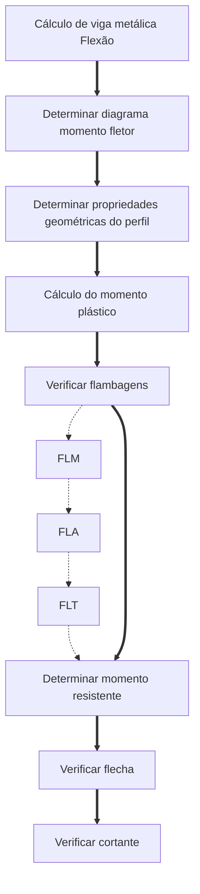
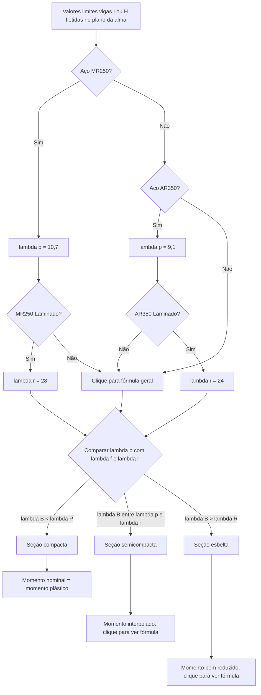

# Flexão

## Fluxograma flexão

## Momento resistente

O momento resistente máximo no estado limite último de uma viga metálica fletida é igual ao momento de plastificação total da seção $M_{pl}$.

$$Z = b_f t_f (d-t_f) + \frac{t_w}{4} (d-2t_f)^2$$

$$M_{pl} = Z_x f_y$$

$$M_d = M_n / \gamma_1$$

>- $Z$ = Módulo plástico da seção transversal
>- $Z = 1,12 W_x$ ou valor da tabela
>- $b_f$ = (beam flange) largura da mesa
>- $t_f$ = (thickness flange) espessura da mesa
>- $d$ = altura da viga 
>- $t_w$ = (thickness web) espessura da alma 
>- $W_x$ momento de inercia em torno do eixo x (transversal à alma, paralelo às mesas)
>- $f_y$ = tensão de escoamento do aço
>- $M_d$ = momento resistente de projeto
>- $\gamma$ = fator de segurança

## Flambagem

Toda peça sob compressão está sujeita à flambagem. 

Quando uma peça está flexionada, apenas a região comprimida pode sofrer flambagem, portanto **devem ser verificadas individualmente mesa e alma**.

### FLM

>Flambagem Local da Mesa

:::tip Passos para verificar FLM
1. Determinar esbeltez da mesa
2. Comparar esbeltez com valores limites
3. Encontrar o momento resistente
:::

Abaixo seguem fórmulas para cálculo generalizados.

:::warning ATALHO 
Para aços usuais pode-se usar o [fluxograma FLM](#fluxograma-flm)
:::

#### Esbeltez da mesa

$$\lambda_b = \frac{b_f}{2t_f}$$
$$\lambda_p = 0,38 \sqrt{\frac{E}{f_y}}$$
$$\lambda_f = C \sqrt{\frac{E}{0,7 {f_y}/{k_c} }}$$

>- $\lambda_b$ = esbeltez da mesa
>- $b_f$ = (beam flange?) largura da mesa
>- $t_f$ = (thickness flange?) espessura da mesa
>- $C$ =  (constante de empenamento) 0,83 para laminados e 0,95 para soldados

Ao comparar o $\lambda_b$ com os valores limites, categorizar a mesa como **compacta, semicompacta ou esbelta**

:::warning Categorias da mesa
##### FLM compacta

Caso $\lambda_b < \lambda_p$:
$$M_n = M_{pl}$$

##### FLM semicompacta

Caso $\lambda_p < \lambda_b < \lambda_r$, faz-se uma interpolação do caso favorável e desfavorável:
$$M_n = M_{pl} - \frac{(\lambda_b - \lambda_p)}{(\lambda_r - \lambda_p)}(M_{pl} - M_r)$$

##### FLM esbelta

Caso $\lambda_b > \lambda_r$:

- Para laminados:
$$M_n = \frac{0,69 E}{\lambda_{b}^2} W_x$$

- Para soldadas:
$$M_n = \frac{0,9 k_c}{\lambda_{b}^2} W_x$$
$$k_c = \frac{4}{h_0/t_0}$$
:::

#### Fluxograma FLM

> Fonte: Tabela 6.1 PFEIL

### FLA

Flambagem Local da Alma

### FLT

Flambagem Lateral com Torção

Ocorre em vigas sem contenção lateral ou parcialmente contidas.
Verificar FLT para os trechos das vigas parcialmente contidas.
Dispensa verificação quando contidas lateralmente em todo trecho (ex: vigas de lajes). 